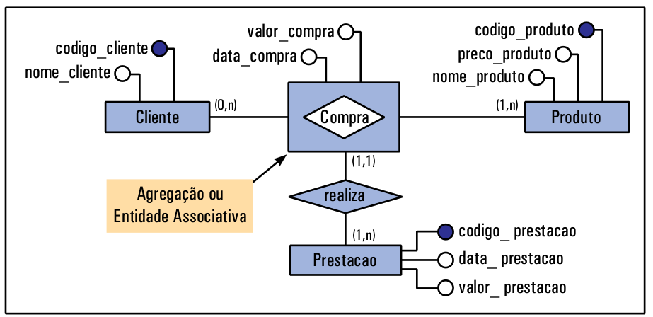

# Entidade Associativa 

**Entidade associativa** ocorre quando precisamos relacionar dois relacionamentos entre si.

Imagine que tenhamos duas entidades **Cliente** e **Produto** ligadas pelo relacionamento **Compra**. Agora, suponha que tenhamos que modificar esse modelo de modo que seja necessário saber quantas prestações serão pagas em uma compra. Relacionar a entidade **Prestação** com **Cliente** ou com **Produto** não faz sentido, uma vez que as prestações serão referentes à compra efetuada. Sendo assim, a entidade **Prestação** deve se relacionar à **Compra**, como mostra a figura abaixo. O retângulo desenhado em volta do relacionamento indica que o relacionamento tornou-se uma **entidade associativa**.

É possível também reescrever o diagrama ER anterior sem utilizar entidade associativa. Neste caso, o relaciomento **Compra** seria transformado em uma **entidade** que poderia ser relacionada à **Prestação**, conforme figura abaixo.

É importante ressaltar que um mesmo problema pode ter diferentes interpretações, e assim gerar diagramas diferenciados. Isso não significa que apenas um dos diagramas está certo.

## Quando usar Entidade Associativa e Quando Usar Atributo descritivo (atributo de relacionamento)

* **Entidades Associativas:** Use quando o relacionamento tem múltiplos atributos ou quando esses atributos são complexos e precisam ser tratados como uma entidade separada.

* **Atributos Descritivos:** Use quando o relacionamento tem poucos atributos simples que não justificam a criação de uma nova entidade

**Muito Importante:** entidades associativas, geralmente, são criadas quando temos entre as entidades um relacionamento n:m. Em relacionamentos muitos-para-muitos (N:M), é comum usar uma entidade associativa para gerenciar as instâncias do relacionamento. 

<!--Isso permite que você adicione atributos específicos do relacionamento, como data de início, quantidade, etc., que não fariam sentido nas entidades originais. -->

<!--
### Entidade Associativa vs Relacionamento com Atributos

### Relacionamento com Atributos

* **Definição:** Um relacionamento com atributos é um relacionamento entre duas ou mais entidades que possui seus próprios atributos.

* **Uso:** Utilizado quando o relacionamento em si precisa armazenar informações adicionais. Por exemplo, em um relacionamento ***Empresta*** entre ***Aluno*** e ***Livro***, o atributo ***Data de Empréstimo*** pode ser associado diretamente ao relacionamento.

* **Vantagens:** Simplicidade e clareza, especialmente quando o número de atributos do relacionamento é pequeno.

* **Desvantagens:** Pode se tornar confuso se o relacionamento tiver muitos atributos ou se precisar se relacionar com outras entidades.

### Entidade Associativa

* **Definição:** Uma entidade associativa é uma entidade que representa um relacionamento entre duas ou mais entidades e possui seus próprios atributos.

* **Uso:** Utilizada quando o relacionamento precisa ser tratado como uma entidade independente, especialmente quando possui muitos atributos ou precisa se relacionar com outras entidades. Por exemplo, em um relacionamento ***Empresta*** entre ***Aluno*** e ***Livro***, a entidade associativa ***Empréstimo*** pode ter atributos como ***Data de Empréstimo*** e ***Data de Devolução***.

* **Vantagens:** Maior flexibilidade e clareza em diagramas complexos, permitindo que o relacionamento tenha seus próprios atributos e se relacione com outras entidades.

* **Desvantagens:** Pode adicionar complexidade ao modelo, tornando-o mais difícil de entender e gerenciar;

-->